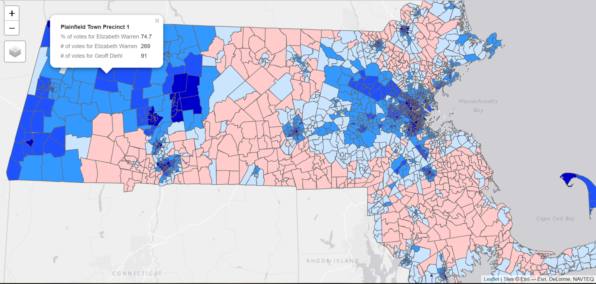
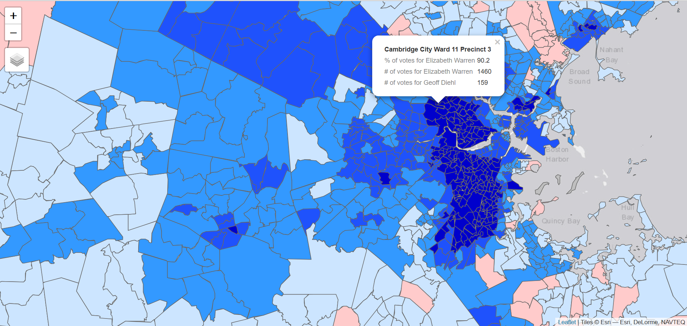

# elections-map
## Project
  [**Interactive map**](http://rpubs.com/chocopie645/521703) of bipartisan votes in all 2152 Massachusetts precincts in the 2018 US Senate election.

## Motivation
 The goal of this project is to create a user friendly interactive map of all bipartisan votes in all 2152 voting Massachusetts precincts for residents to see how their precinct voted in the 2018 US Senate election, where the democrat candidate was Elizabeth A. Warren and the republican candidate was Geoff Diehl. 
 
 Compared to towns, wards, or municipalities, precinct voting data is hard to come by and not readily available, yet is monumentally important in the study of election science. For example, the closest project in terms of similarity to mine is WBUR's Mass election results, which only goes as in depth of results from 256 towns rather than the 2152 precincts in Massachusetts. 
 
## Final result
- Here are some screenshots of the final interactive map. The useable interactive map can be found in the header




## Code
### Setup
- Loading in raw precinct voting data for US senate and house from MassGov
- Loading in a precincts crosswalk file I created between shapefile and voting data for joining purposes
- Reading in and exploring shape file/GIS data
- Subsetting out bipartisan US Senate election results data

Please adjust working directory on your own computer as necessary, and refer to full R code in repo to load in needed libraries.

```r
setwd("C:/Users/User/Documents/GitHub/elections-map/elections-map")
fed<-read.csv("mass_federal.csv")
pxwalk<-read.csv("crosswalk.csv")
setwd("C:/Users/User/Documents/GitHub/elections-map/elections-map/wardsprecincts_poly")
magis <- readOGR("WARDSPRECINCTS_POLY.shp")
magis@data
MAsen <- fed[fed$office=="US Senate" & (fed$name=="Elizabeth A. Warren" | fed$name=="Geoff Diehl"),]
```
* side note * In order to simplify the visualisation process, I removed data regarding votes for the independent senate candidate, blank votes, and votes titled "all other". Treating the race as a purely bipartisan and only looking at the subset of people who voted for Warren or Diehl race may lead to inaccuracies or misleading ideas, but the median percentage of votes that didn't go to these two candidates per town is 5.2% which is low and may not affect results too heavily.

### Data wrangling and manipulation
- Variable for joining crosswalk and shape file
```r
WP <- case_when(!MAsen$ward=="-" ~ paste(MAsen$ward,MAsen$precinct,sep="-"),
                TRUE ~ as.character(MAsen$precinct))
MAsen$xwalk<-paste(MAsen$town,WP,sep=" ")
```
- Vectors aggregating votes in each precinct for Elizabeth Warren, Geoff Diehl, and combined votes
```r
warren<-aggregate(MAsen$votes[MAsen$name=="Elizabeth A. Warren"], by=list(Category=MAsen$xwalk[MAsen$name=="Elizabeth A. Warren"]), FUN=sum)
colnames(warren) <- c("Town", "Votes for Elizabeth A. Warren")
diehl<-aggregate(MAsen$votes[MAsen$name=="Geoff Diehl"], by=list(Category=MAsen$xwalk[MAsen$name=="Geoff Diehl"]), FUN=sum)
colnames(diehl) <- c("Town", "Votes for Geoff Diehl")
total<-aggregate((MAsen$votes), by=list(Category=MAsen$xwalk), FUN=sum)
colnames(total) <- c("Town", "Total Votes")
```
- Proportions of votes in precincts
```r
warrenproportion <- warren$`Votes for Elizabeth A. Warren`/total$`Total Votes` * 100
warrenproportion <- round(warrenproportion,1)
diehlproportion <- diehl$`Votes for Geoff Diehl`/total$`Total Votes` * 100
diehlproportion <- round(diehlproportion,1)
votes<-cbind(warren$`Town`,warren$`Votes for Elizabeth A. Warren`,diehl$`Votes for Geoff Diehl`,total$`Total Votes`, warrenproportion,diehlproportion)
colnames(votes) <- c("xwalk", "Votes for Elizabeth A. Warren", "Votes for Geoff Diehl", "Total Votes", "Percentage of Votes for Warren", "Percentage of Votes for Diehl")
```
- Attribute join: final voting data to GIS data
```r
magis@data<-left_join(magis@data,pxwalk,by=c('WP_NAME'='gis_precincts'))
votes<-as.data.frame(votes)
magis@data<-left_join(magis@data,votes,by=c('medsl_precinct_1'='xwalk'))
```
This finalized data was then used to create the maps found above.
